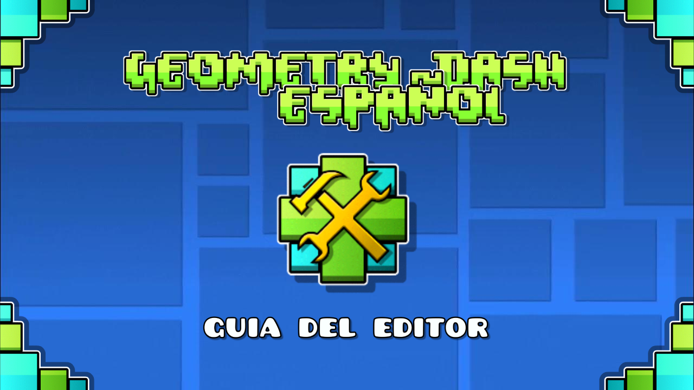

# Guia del Editor
Traduccion no oficial al español de la guia del editor de Geometry Dash, puedes visitar el sitio web [aqui](https://guia.editorgd.xyz)

# Contribuir
Al contribuir de cualquier forma, se te sera agregado a los creditos, puedes contribuir a la traduccion de la guia al español de las siguientes maneras:

- Si sabes usar GitHub, puedes traducir los archivos que se encuentran en la carpeta `guias`, y hacer un pull request con los archivos traducidos

- De no ser asi, puedes unirte al [Servidor de Discord](https://discord.gg/aWC55M4q4v), donde puedes enviar tus traducciones, estas seran subidas a GitHub de igual forma

Para mantener la guia consistente, se te recomienda unirte al servidor de Discord de todas formas, donde la traduccion sera organizada. Tambien puedes contribuir a la pagina como tal desde Github
